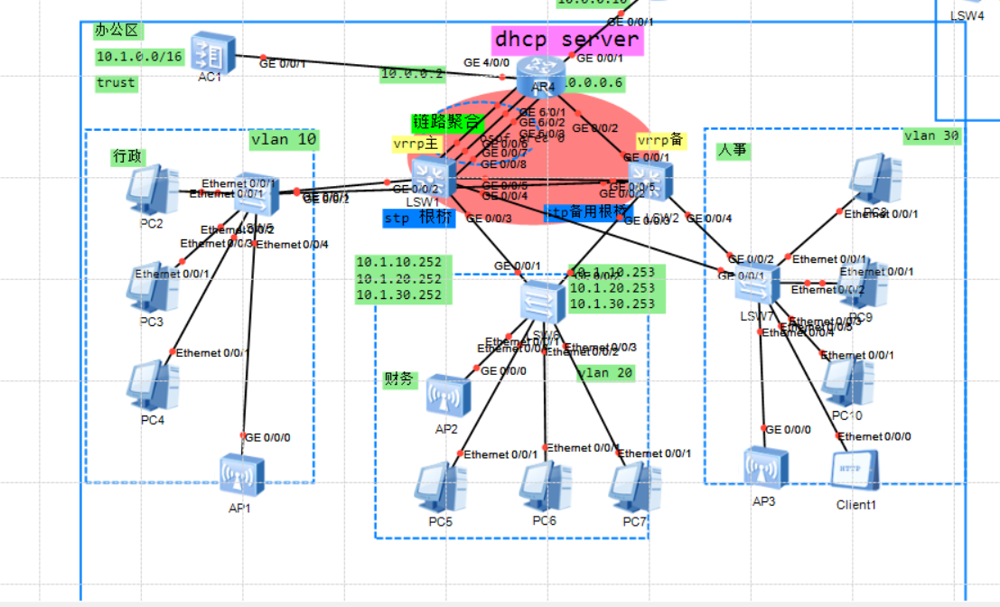
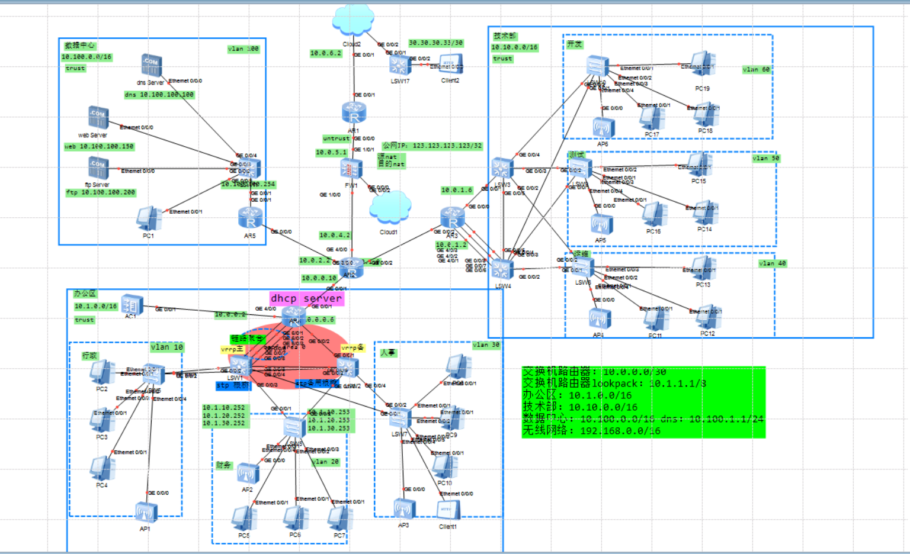

# ENSP 企业网络实验室拓扑 - 华为 eNSP 大型企业网络仿真项目

 

**项目地址**：https://github.com/jianggege900/ensp-enterprise-network-labs.git  
**仿真软件**：华为 eNSP（Enterprise Network Simulation Platform）  
**地址规划**：全网使用 **10.0.0.0/8** 私有地址段

---

## 📋 项目介绍

这是一个**完整的企业级网络拓扑实验项目**，使用华为 eNSP 模拟了一个大型企业的生产网络环境。项目严格按照真实企业网络设计原则构建，涵盖了**高可用性、负载均衡、安全访问、服务部署**等多方面内容，适合学习 HCIA、HCIP、HCIE 或 CCNP Enterprise 的同学参考。

整个网络分为**三大核心区域**：
- **办公区**（Office Area）
- **技术部门**（Technical Department）
- **数据中心**（Data Center）

办公区与技术部门均采用 **VRRP 双网关冗余** 设计，实现核心层高可用；每个区域部署独立的 **DHCP 服务器**，为本区域所有 VLAN 动态分配 IP；核心链路全部使用 **Eth-Trunk 链路聚合** 实现流量负载均衡与带宽叠加。

数据中心部署了企业关键服务：**DNS 服务器**、**Web 服务器**、**FTP 服务器**。核心路由器通过防火墙（AR 设备）连接外部公网，配置了 **源 NAT + 目的 NAT**，并通过端口映射实现公网用户对内部 Web 服务器的访问。

---

## 🖼️ 拓扑截图

### 截图 1：办公区核心视图（包含 VRRP 主备、DHCP、VLAN 划分、链路聚合）

### 截图 2：完整企业网络拓扑（含数据中心、技术部门、外部云连接、NAT 防火墙）

> **提示**：两张截图已包含项目中所有关键设备（AR 路由器、LSW 交换机、AP 无线接入点、服务器、PC、防火墙等）。建议将原图重命名为 `topology1.png` 和 `topology2.png` 后上传到仓库根目录（或 `images/` 文件夹）。

---

## 🏗️ 网络架构亮点

### 1. 区域化设计与高可用
- **办公区**：VLAN 10（行政）、VLAN 20（财务）、VLAN 30（人事）等
- **技术部门**：VLAN 40/50/60 等
- **数据中心**：独立信任域（10.100.0.0/16）
- **VRRP** 主备网关（办公区 + 技术部门）
- **STP** 根桥优化防止环路

### 2. IP 地址与服务规划（参考截图绿色标注）
- 全网私有地址：**10.0.0.0/8**
- 办公区：10.1.0.0/16
- 技术部：10.10.0.0/16
- 数据中心：10.100.0.0/16
- DHCP 服务器统一分配各 VLAN 地址
- 公网出口：123.123.123.0/24（模拟）

### 3. 关键技术应用
- **链路聚合（Eth-Trunk）**：多 GE 接口捆绑，实现负载均衡与冗余
- **DHCP 服务器**：区域化部署（每个区域一台 AR 担任）
- **NAT**：核心防火墙配置源 NAT（内网访问外网）+ 目的 NAT（端口映射）
- **服务器端口映射**：公网可访问企业内部 Web 服务器
- **无线网络**：AP1~AP6 覆盖办公区与技术部门（192.168.0.0/16）
- **DNS/Web/FTP 服务**：全部部署在数据中心信任区

### 4. 安全与访问控制
- 数据中心与办公区严格划分 trust/untrust 区域
- 防火墙源 NAT + 目的 NAT 双重保护
- 公网 IP 映射仅开放 Web 服务端口

---

## 📂 项目结构

---

## 🚀 如何运行

1. 安装最新版 **华为 eNSP**（推荐 v1.3 以上）
2. 下载本仓库全部文件
3. 双击 `.topo` 拓扑文件（或手动导入设备）
4. 启动设备，加载 `config` 目录下的配置文件
5. 测试连通性：
   - PC 间互 Ping
   - DHCP 自动获取 IP
   - VRRP 主备切换
   - 公网访问 Web 服务器

---

## 🎯 学习价值

- 掌握大型企业**分区域网络设计**思路
- 熟练应用 **VRRP + DHCP + Eth-Trunk** 组合
- 理解 **NAT 端口映射** 在真实生产环境的应用
- 体验从核心到接入层的完整网络部署流程
- 可直接用于毕业设计、项目汇报、HCIE 实验

---

## 📌 后续优化方向（欢迎 PR）
- 添加 OSPF/BGP 动态路由
- 引入 IPSec VPN 远程接入
- 部署 ACL 精细化访问控制
- 添加 SDN/控制器管理
- 无线漫游与 802.1X 认证

---

**欢迎 Star ⭐、Fork 与 Issue！**  
如果你也在学习华为网络或准备 HCIE 考试，这个项目可以作为你的参考模板。

**作者**：jianggege900  
**联系**：jianggege900@gmail.com

---

*最后更新：2026年3月*